# Agent Architecture - Overall Overview

This diagram provides a high-level view of the Neo0Agent MCP Server architecture.

```mermaid
graph TB
    WebServer("🌐 Starlette Server<br/><i>MCP Server</i>")
    Agents("🤖 Neo-0 Agent")
    Resources("📦 Resources<br/>site://{id}/index.html")
    CodeGen("🛠️ CodeGen<br/><i>HTML, JS, CSS</i>")
    Storage("💾 Storage<br/>generated_sites/{site_id}/")
    SiteGenerationGraph("⚙️ SiteGenerationGraph<br/>StateGraph")

    %% Connections
    WebServer --> Agents
    Agents --> SiteGenerationGraph
    SiteGenerationGraph --> CodeGen
    SiteGenerationGraph --> Resources
    SiteGenerationGraph --> Storage

    style WebServer fill:#6366F1,color:#fff
    style CodeGen fill:#8B5CF6,color:#fff
    style Resources fill:#EC4899,color:#fff
    style Agents fill:#10B981,color:#fff
    style Storage fill:#F59E0B,color:#000
    style SiteGenerationGraph fill:#14B8A6,color:#fff
```

## Key Components

### MCP Server Components

- **CodeGen**: Generates HTML, JS, and CSS for site operations (`generate_site` and `manage_site_files`)
- **Resources**: MCP resources providing access to generated site files
- **Neo0Agent**: Specialized AI agent built on SpoonReactAI framework
- **Storage**: Directory structure (`generated_sites/{site_id}/`) for storing generated sites

### Site Generation Workflow

- **SiteGenerationGraph**: StateGraph-based workflow orchestration
- **Multi-step Process**: Template creation → Content generation → Verification

### Web Server

- **Starlette Server**: MCP server implementation using FastMCP, serves generated sites
- **Transport Protocols**: Supports both stdio (for Claude Desktop/Cursor) and SSE (for web clients)
- **Site Viewer**: Dynamic routing (`/sites/{site_id}`) to view generated sites
