# Agent Architecture - Overall Overview

This diagram provides a high-level view of the Neo0Agent MCP Server architecture.

```mermaid
graph TB
    WebServer("🌐 Starlette Server<br/><i>MCP Server</i>")
    Agents("🤖 Neo-0 Agent")
    Resources("📦 Resources<br/><i>File access & editing</i>")
    CodeGen("🛠️ CodeGen<br/><i>HTML, JS, CSS</i>")
    Validator("✅ Validator<br/><i>Verifies code correctness</i>")
    SiteGenerationGraph("⚙️ SiteGenerationGraph<br/>StateGraph")

    %% Connections
    WebServer --> Agents
    Agents --> SiteGenerationGraph
    SiteGenerationGraph --> CodeGen
    SiteGenerationGraph --> Validator
    SiteGenerationGraph --> Resources

    style WebServer fill:#6366F1,color:#fff
    style CodeGen fill:#8B5CF6,color:#fff
    style Resources fill:#EC4899,color:#fff
    style Agents fill:#10B981,color:#fff
    style Validator fill:#F59E0B,color:#000
    style SiteGenerationGraph fill:#14B8A6,color:#fff
```

## Key Components

### MCP Server Components

- **CodeGen**: Generates HTML, JS, and CSS for site operations (`generate_site` and `manage_site_files`)
- **Resources**: MCP resources (`site://{id}/index.html`, `site://{id}/metadata.json`) responsible for handling files and providing access for viewing, editing, and future modifications
- **Neo0Agent**: Specialized AI agent built on SpoonReactAI framework
- **Validator**: Verifies that generated code works correctly by checking for required components (React imports, createRoot, TailwindCSS, root div, import map, content completeness, and absence of placeholders)

### Site Generation Workflow

- **SiteGenerationGraph**: StateGraph-based workflow orchestration
- **Multi-step Process**: Template creation → Content generation → Validation → Completion
- **Validator**: Ensures generated code meets quality standards by verifying all required dependencies, components, and structure are present and correct

### Web Server

- **Starlette Server**: MCP server implementation using FastMCP, serves generated sites
- **Transport Protocols**: Supports both stdio (for Claude Desktop/Cursor) and SSE (for web clients)
- **Site Viewer**: Dynamic routing (`/sites/{site_id}`) to view generated sites
