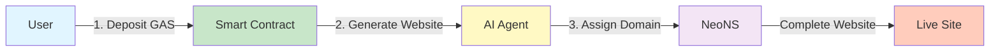
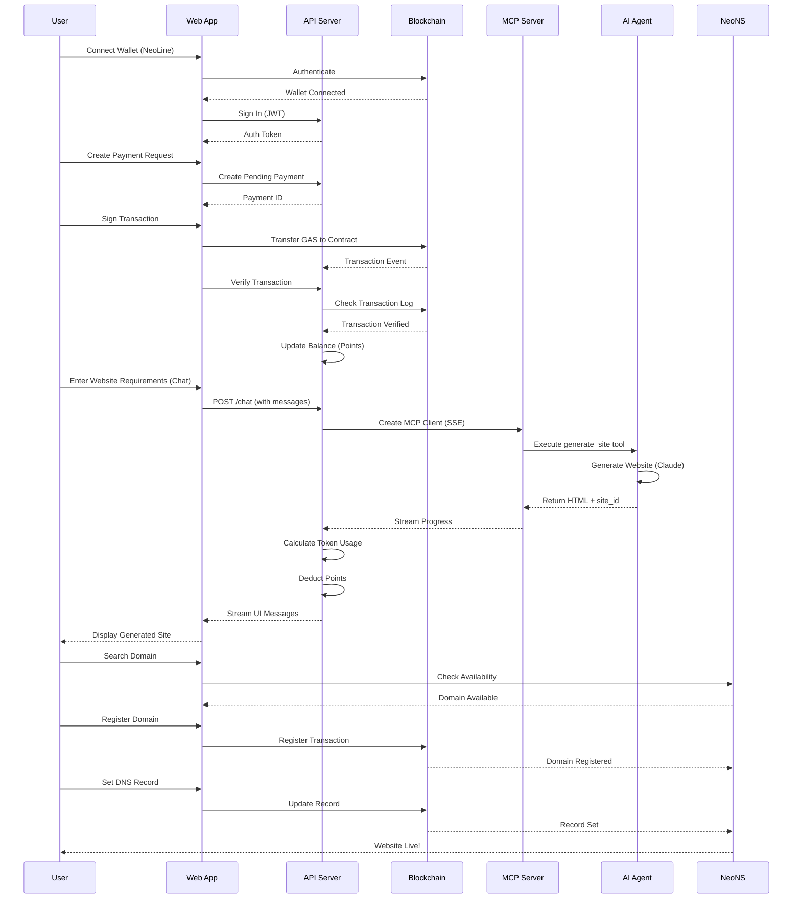
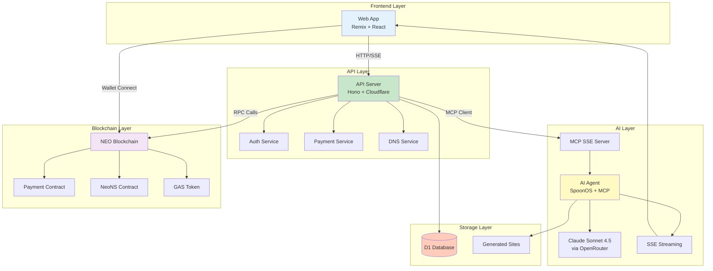
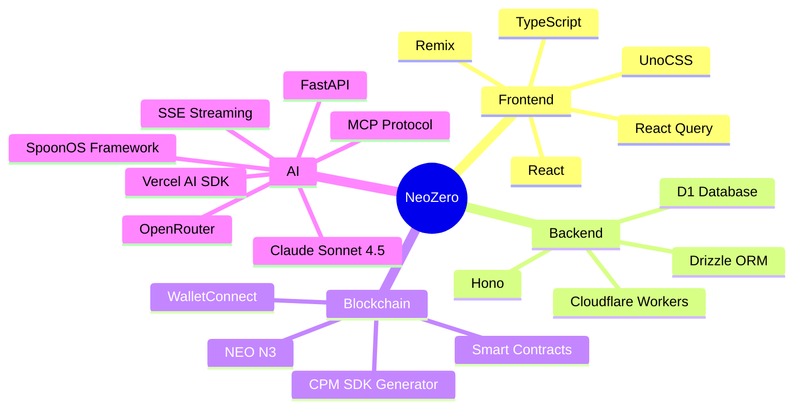
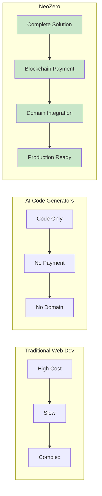
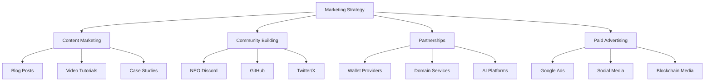
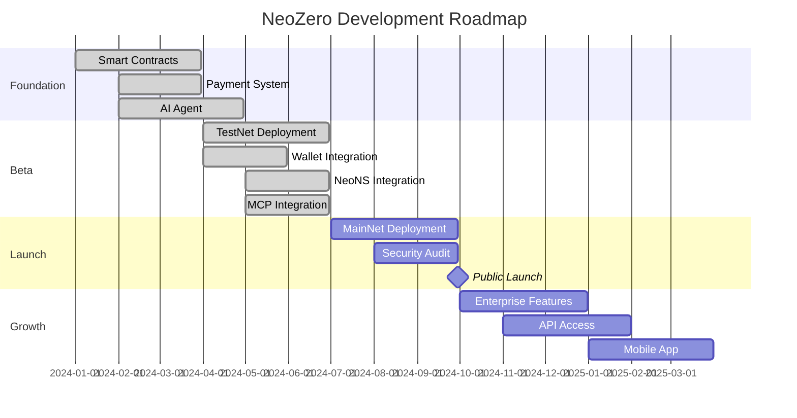
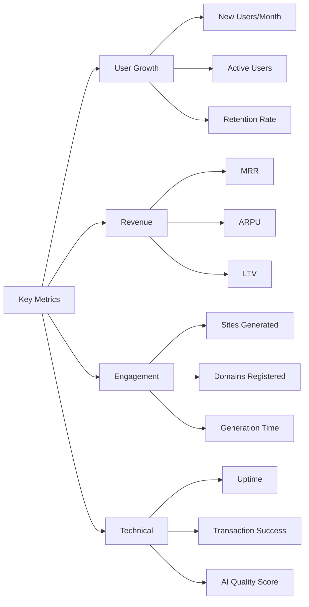
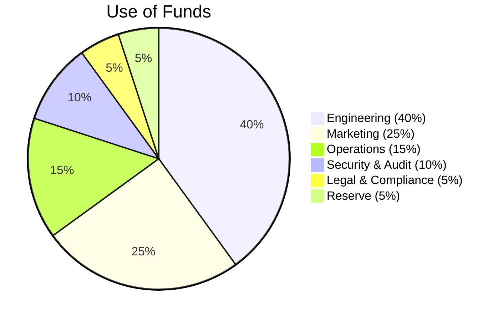

# NeoZero: Pitch Deck

**AI-Powered Website Generation on NEO Blockchain**

---

## 🎯 The Vision

**NeoZero** is revolutionizing web development by combining AI-powered website generation with blockchain-based payments and decentralized domain management. We enable anyone to create production-ready websites in minutes, paid for with cryptocurrency, and owned through blockchain domains.

---

## 📊 The Problem

### Current Pain Points

1. **High Development Costs**
   - Traditional web development: $5,000 - $50,000+
   - Requires technical expertise or expensive agencies
   - Long development cycles (weeks to months)

2. **Payment Friction**
   - Complex payment processing
   - Geographic restrictions
   - High transaction fees
   - Slow settlement times

3. **Domain Management Complexity**
   - Centralized domain registrars
   - Annual renewal fees
   - Transfer restrictions
   - No true ownership

4. **AI Tools Limitations**
   - Most AI tools generate code, not complete websites
   - No integrated payment system
   - No domain integration
   - Limited customization

### Market Size

- **Global Web Development Market**: $56.5B (2024) → $89.3B (2029)
- **AI in Web Development**: $2.1B (2024) → $8.5B (2029)
- **Blockchain Domain Market**: $1.2B (2024) → $5.8B (2029)
- **Total Addressable Market**: $60B+ by 2029

---

## 💡 The Solution

NeoZero provides a **complete, integrated platform** that solves all these problems:

### Three-Step Process

### Key Benefits

✅ **Instant Website Generation** - Create sites in minutes, not weeks  
✅ **Blockchain Payments** - Pay with GAS tokens, no credit cards needed  
✅ **True Domain Ownership** - Own your domain on-chain forever  
✅ **No Technical Skills Required** - Natural language prompts only  
✅ **Production-Ready** - Complete HTML with React, TailwindCSS, and more  

---

## 🏗️ Product Overview

### Core Features

#### 1. **Blockchain Payment System**
- Deposit GAS tokens into NEO smart contract
- Automatic balance tracking
- Transparent transaction history
- No intermediaries

#### 2. **AI Website Generation**
- Powered by Claude Sonnet 4.5 (via OpenRouter)
- MCP (Model Context Protocol) integration
- Real-time SSE streaming progress
- Graph-based workflow for structured generation
- Chat interface for natural language interaction
- Multiple AI models supported
- Points-based usage tracking

#### 3. **NeoNS Domain Integration**
- Search available domains
- Register domains on-chain
- Set DNS records
- Manage domain portfolio

### User Journey

---

## 🏛️ Technology Architecture

### System Architecture

### Technology Stack

---

## 💰 Business Model

### Revenue Streams

1. **Transaction Fees**
   - Small fee on each GAS deposit (2-5%)
   - Transparent and competitive

2. **Generation Credits**
   - Prepaid credits for website generation
   - Volume discounts for enterprise

3. **Premium Features**
   - Advanced AI models
   - Priority generation queue
   - Custom domain templates

4. **Enterprise Solutions**
   - White-label platform
   - API access
   - Custom integrations

### Pricing Model

| Tier | Price | Features |
|------|-------|----------|
| **Free** | $0 | 1 site/month, Basic AI |
| **Starter** | $10/month | 10 sites/month, Standard AI |
| **Pro** | $50/month | Unlimited sites, Premium AI, Priority |
| **Enterprise** | Custom | White-label, API, Custom models |

### Unit Economics

- **Customer Acquisition Cost (CAC)**: $15-25
- **Lifetime Value (LTV)**: $200-500
- **LTV/CAC Ratio**: 10-20x
- **Gross Margin**: 75-85%

---

## 🚀 Competitive Advantage

### Why NeoZero Wins

### Key Differentiators

1. **Only Platform** combining AI generation + blockchain payments + domain management
2. **True Ownership** - Domains stored on-chain, not rented
3. **Instant Settlement** - Blockchain payments settle immediately
4. **No Vendor Lock-in** - Open source, decentralized infrastructure
5. **Production-Ready** - Sites work immediately, no deployment needed

---

## 📈 Go-to-Market Strategy

### Phase 1: Launch (Months 1-3) ✅
- ✅ Beta launch on NEO TestNet
- ✅ Core features implemented (payment, AI generation, NeoNS)
- ✅ MCP integration complete
- 🎯 Target: 100 early adopters
- 🎯 Focus: Developer community
- 🎯 Channels: NEO Discord, GitHub, Twitter

### Phase 2: Growth (Months 4-6)
- 🎯 MainNet launch
- 🎯 Target: 1,000 active users
- 🎯 Focus: Small businesses, creators
- 🎯 Channels: Content marketing, partnerships

### Phase 3: Scale (Months 7-12)
- 🚀 Enterprise features
- 🚀 Target: 10,000+ users
- 🚀 Focus: Agencies, enterprises
- 🚀 Channels: Sales team, integrations

### Marketing Channels

---

## 🗺️ Roadmap

### Q1 2024: Foundation ✅
- [x] Smart contract development (VibeCodingAppPaymentContract)
- [x] Payment system integration
- [x] AI agent setup (SpoonOS + MCP)
- [x] Basic UI/UX (Remix + React)
- [x] Wallet integration (NeoLine)
- [x] CPM SDK generation

### Q2 2024: Beta Launch ✅
- [x] TestNet deployment
- [x] Wallet integrations (NeoLine)
- [x] NeoNS integration
- [x] MCP protocol implementation
- [x] Chat interface
- [x] Points system
- [ ] Beta user testing

### Q3 2024: MainNet Launch 🎯
- [ ] MainNet deployment
- [ ] Security audit
- [ ] Public launch
- [ ] Marketing campaign
- [ ] Performance optimization

### Q4 2024: Growth 📈
- [ ] Enterprise features
- [ ] API access (public endpoints)
- [ ] Mobile app
- [ ] International expansion
- [ ] Advanced analytics

### 2025: Scale 🌍
- [ ] Multi-chain support
- [ ] Advanced AI models
- [ ] Marketplace for templates
- [ ] White-label solution
- [ ] Decentralized hosting

### Timeline Visualization

---

## 👥 Team & Technology

### Core Technologies

**Frontend**
- Remix (React framework)
- TypeScript (type safety)
- UnoCSS (styling)
- React Query (data fetching)

**Backend**
- Hono (web framework)
- Cloudflare Workers (edge computing)
- Drizzle ORM (database)
- D1 Database (SQLite)

**Blockchain**
- NEO N3 (blockchain platform)
- Smart Contracts (TypeScript)
- CPM (SDK generator)
- WalletConnect (wallet integration)

**AI**
- SpoonOS (agent framework)
- Claude Sonnet 4.5 (LLM)
- FastAPI (Python server)
- SSE (streaming)

### Open Source Commitment

- Core platform: Open source
- Smart contracts: Verified on-chain
- SDKs: Publicly available
- Documentation: Comprehensive guides

---

## 📊 Key Metrics & Traction

### Success Metrics

### Target Metrics (Year 1)

- **Users**: 10,000+
- **Websites Generated**: 50,000+
- **Domains Registered**: 5,000+
- **Monthly Revenue**: $50,000+
- **Customer Satisfaction**: 4.5+/5.0

---

## 💼 Investment & Funding

### Use of Funds

### Funding Needs

- **Seed Round**: $500K - $1M
- **Use Cases**:
  - Team expansion (5-10 engineers)
  - Marketing & growth
  - Security audits
  - Infrastructure scaling

### Exit Strategy

- **Acquisition**: Strategic buyers (web3 platforms, AI companies)
- **IPO**: Long-term option
- **Token Launch**: Potential tokenization of platform

---

## 🎯 Call to Action

### For Investors

**Join us in revolutionizing web development**

- **Market Opportunity**: $60B+ TAM
- **Unique Position**: First-mover in blockchain + AI web dev
- **Strong Team**: Experienced in blockchain, AI, and web development
- **Proven Technology**: Working prototype, active development

**Contact**: [Your Contact Information]

### For Partners

**Let's build together**

- **Wallet Providers**: Integrate NeoZero into your wallet
- **Domain Services**: Partner for domain management
- **AI Platforms**: Collaborate on AI capabilities
- **Web3 Projects**: White-label our platform

**Contact**: [Your Contact Information]

### For Users

**Start building today**

- **Beta Access**: Join our TestNet beta
- **Early Adopter Benefits**: Lifetime discounts
- **Community**: Join our Discord
- **Documentation**: Comprehensive guides available

**Get Started**: [Your Website URL]

---

## 📞 Contact & Resources

### Links

- **Website**: [Your Website]
- **GitHub**: [Your GitHub]
- **Documentation**: [Your Docs]
- **Discord**: [Your Discord]
- **Twitter**: [Your Twitter]

### Demo

- **Live Demo**: [Demo URL]
- **TestNet**: [TestNet URL]
- **Video Walkthrough**: [Video URL]

---

## 📄 Appendix

### Technical Specifications

- **Blockchain**: NEO N3 TestNet → MainNet
- **Smart Contracts**: TypeScript (neo-devpack-ts)
- **Payment Contract**: `0x3b548112507aad8ab8a1a2d7da62b163d97c27d7` (TestNet)
- **GAS Token**: `0xd2a4cff31913016155e38e474a2c06d08be276cf`
- **NeoNS Contract**: `0xd4dbd72c8965b8f12c14d37ad57ddd91ee1d98cb`
- **AI Model**: Claude Sonnet 4.5 (via OpenRouter)
- **AI Protocol**: MCP (Model Context Protocol)
- **Infrastructure**: Cloudflare Workers + D1 Database
- **Frontend**: Remix + React + TypeScript + UnoCSS
- **Backend**: Hono + Cloudflare Workers
- **AI Framework**: SpoonOS (Python) + FastAPI

### Security

- ✅ Smart contract audits (planned)
- ✅ Secure wallet integration
- ✅ Encrypted API communications
- ✅ Regular security updates

### Compliance

- ✅ Open source licensing
- ✅ GDPR considerations
- ✅ Blockchain transparency
- ✅ User data privacy

---

**Thank you for your interest in NeoZero!**

*Building the future of web development, one blockchain transaction at a time.*

---

*Last Updated: [Date]*  
*Version: 1.0*

